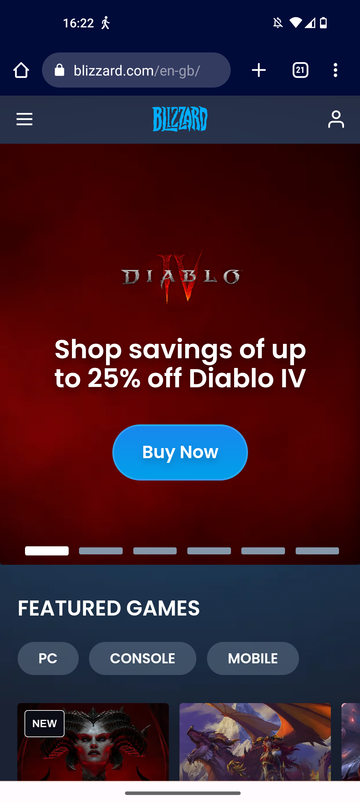
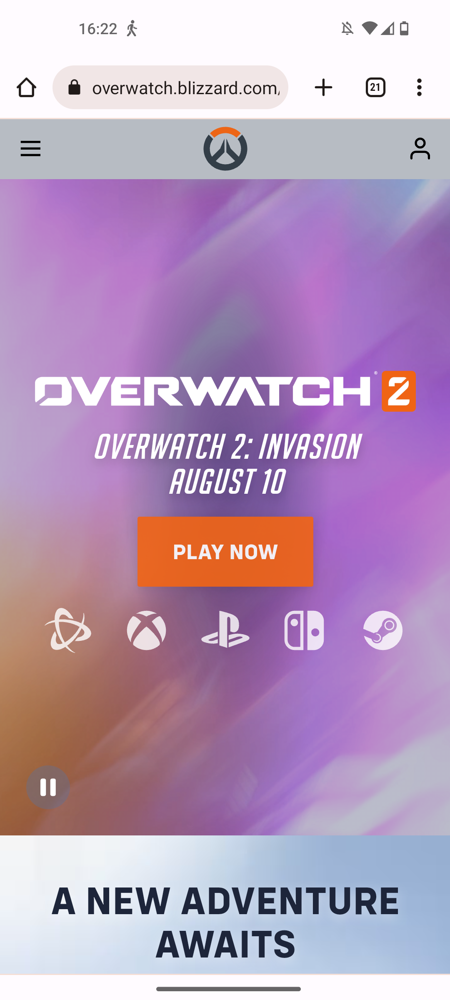

# Procesverslag
Markdown is een simpele manier om HTML te schrijven.  
Markdown cheat cheet: [Hulp bij het schrijven van Markdown](https://github.com/adam-p/markdown-here/wiki/Markdown-Cheatsheet).

Nb. De standaardstructuur en de spartaanse opmaak van de README.md zijn helemaal prima. Het gaat om de inhoud van je procesverslag. Besteedt de tijd voor pracht en praal aan je website.

Nb. Door *open* toe te voegen aan een *details* element kun je deze standaard open zetten. Fijn om dat steeds voor de relevante stuk(ken) te doen.

## Jij

  
uitwerken voor kick-off werkgroep

  ### Auteur:
  Sybren Loos

  #### Je startniveau:
  Rood

  #### Je focus:
  Ik wil voornamelijk op surface plane focussen
 

## Je website

  
uitwerken voor kick-off werkgroep

  ### Je opdracht:
  https://www.blizzard.com/en-gb/ 

  #### Screenshot(s) van de eerste pagina (small screen): 
  Home page 
  

  #### Screenshot(s) van de tweede pagina (small screen):
  Info page
  
 

## Toegankelijkheidstest 1/2 (week 1)

  
uitwerken na test in 2e werkgroep

  ### Bevindingen
  Lijst met je bevindingen die in de test naar voren kwamen:

  Bij de toegankelijkheids testen kwamen er verwachte maar ook schokkende bevindingen naar voren. 
  We waren al voorberijd dat de meeste websites helemaal niet toegankelijk zouden zijn maar de website die ik had gekozen (blizzard) was nog veel erger dan verwacht. Er waren vele manieren waardoor het onmogelijk werd voor een blind iemand die een screenreader moet gebruiken. Een groot voorbeeld hiervan was hoe de screenreader de hamburgermenu's of hele stukken van de website oversloeg. Als je een gebruiker van een screenreader was, werd het zo ongeveer onmogelijk om goed te navigeren op de website. Dit kwam voornamelijk door de absurde hoeveelheden van divs. Hierdoor kon de website een heel groot deel vvan de website niet lezen. Hiernaast was wat de screenreader wel kon lezen verschrikkelijk slecht beschreven. Een voorbeeld hiervan is hoe bij de meeste knoppen de alttext gewoon voor las wat er op de knop stond zonder dat er enige andere context bij werd gegeven. Ook moest je vaak voordat je bij de echte informatie kwam door een gigantische hoeveelheid knoppen heen werken. 

  Zoals je ziet is er verschrikkelijk veel mis met de website op dit moment en kan er erg veel opgeruimd worden.

## Breakdownschets (week 1)

  
uitwerken na afloop 3e werkgroep

  ### de hele pagina: 
  

## Voortgang 1 (week 2)

  
uitwerken voor 1e voortgang

  ### Stand van zaken
 Ik heb al erg veel geleerd in de twee weken dat we bezig zijn maar ik merk dat ik wel een beetje achterloop met het namaken van mijn website. Ik heb de HTML volledig uitgewerkt maar heb nog niks gedaan aan mijn CSS. Dit betekent dat ik behoorlijk moet bijpoten om bij te blijven. Maar ik heb vertrouwen dat dit goed kan lukken. 

  ### Agenda voor meeting
  samen met je groepje opstellen

  | student 1      | student 2          | student 3    | student 4        |
  | ---            | ---                | ---          | ---              |
  | dit bespreken  | en dit             | en ik dit    | en dan ik dat    |
  | en dat ook nog | dit als er tijd is | nog een punt | dit wil ik zeker |
  | ...            | ...                | ...          | ...              |

  ### Verslag van meeting
  hier na afloop snel de uitkomsten van de meeting vastleggen

  - punt 1
  - punt 2
  - nog een punt
  - ...

## Voortgang 2 (week 3)

  
uitwerken voor 2e voortgang

  ### Stand van zaken
  Ik ben een groot stuk op geschoten met de css en heb een groot aantal dingen laten werken. Mijn hamburgermenu werkt, de video op de achtergrond werkt en ik heb nu een goed idee hoe ik de rest van de layout aan moet pakken. Dit was wel lastig en ik had behoorlijk wat hulp hiervoor nodig maar het is nu wel gelukt en kan goed verder werken.

  ### Agenda voor meeting
  samen met je groepje opstellen

  | student 1      | student 2          | student 3    | student 4        |
  | ---            | ---                | ---          | ---              |
  | dit bespreken  | en dit             | en ik dit    | en dan ik dat    |
  | en dat ook nog | dit als er tijd is | nog een punt | dit wil ik zeker |
  | ...            | ...                | ...          | ...              |

student 1: Sybren
Ik wil graag bespreken hoe je een carasoul moet maken en hoe ik mijn video op groot scherm 100% kan krijgen.

  ### Verslag van meeting
  hier na afloop snel de uitkomsten van de meeting vastleggen

  - punt 1
  - punt 2
  - nog een punt
- ...

## Toegankelijkheidstest 2/2 (week 4)

  
uitwerken na test in 9e werkgroep

  ### Bevindingen
  Lijst met je bevindingen die in de test naar voren kwamen (geef ook aan wat er verbeterd is):

## Voortgang 3 (week 4)

  
uitwerken voor 3e voortgang

  ### Stand van zaken
  hier dit ging goed & dit was lastig (neem ook screenshots op van delen van je website en code)

  ### Agenda voor meeting
  09:30 in teams op vrijdag voor de lessen

    | Sybren      | David       | Jaden  | vivanne       |
  | ---            | ---                | ---          | ---              |
  | Vraag 1 :Hoe laat ik met een knop specifieke dingen naar voren komen | 
vraag 1: hoe en of ik ::after moet gebruiken| Vraag: hoe laat ik mijn nav animeren?| vraag 1 : hoe voeg ik een scrollbar toe aan een horizontale carousel?  |
  | vraag 2: Wat zijn de beste dingen om toe te passen als je frontend kiest | vraag 2: mijn font dikte is net een beetje anders, font weight werkt niet| Vraag2: hoe zorg ik ervoor dat de em losstaat van mn span| vraag 2 (als genoeg tijd over): hoe zorg ik voor bepaalde animatie bij meer weten section |
  | ...            | ...                | ...          | ...              |

Sybren
Vraag 1 :Hoe laat ik met een knop specifieke dingen naar voren komen
vraag 2: Wat zijn de beste dingen om toe te passen als je frontend kiest

David
vraag 1: hoe en of ik ::after moet gebruiken
vraag 2: mijn font dikte is net een beetje anders, font weight werkt niet

Jaden
Vraag: hoe laat ik mijn nav animeren?
Vraag2: hoe zorg ik ervoor dat de em losstaat van mn span

Vivanne
vraag 1 : hoe voeg ik een scrollbar toe aan een horizontale carousel?
vraag 2 (als genoeg tijd over): hoe zorg ik voor bepaalde animatie bij meer weten section.

  ### Verslag van meeting
  hier na afloop snel de uitkomsten van de meeting vastleggen

  - Nav animeren.
  - Code laten zien carousel, voor vivanne

## Eindgesprek (week 5)

  
uitwerken voor eindgesprek

  ### Je uitkomst - karakteristiek screenshots:
  

  ### Dit ging goed/Heb ik geleerd: 
  Korte omschrijving met plaatjes

  

  ### Dit was lastig/Is niet gelukt:
  Korte omschrijving met plaatjes

  

## Bronnenlijst

  
continu bijhouden terwijl je werkt

  Nb. Wees specifiek ('css-tricks' als bron is bijv. niet specifiek genoeg). 
  Nb. ChatGpT en andere AI horen er ook bij.
  Nb. Vermeld de bronnen ook in je code.

  1. bron 1
  2. bron 2
  3. ...

